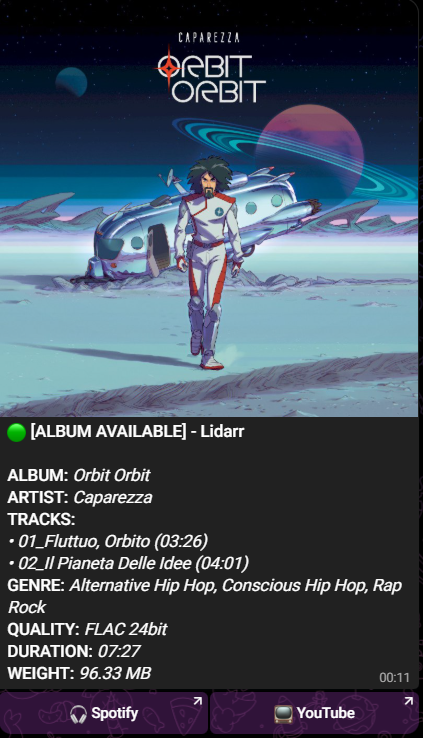
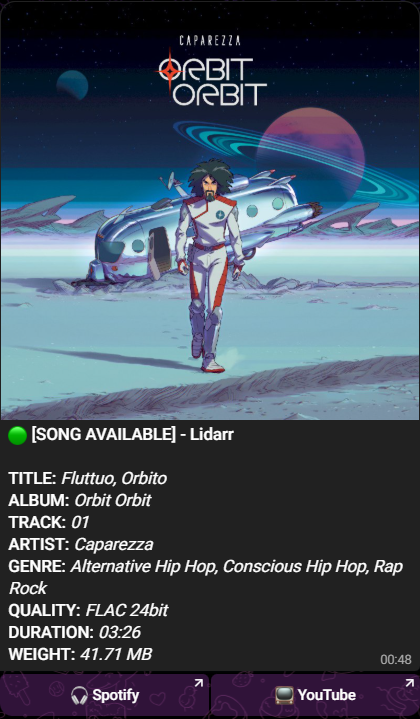

# Arr-Telegram-Notifier

A professional bash script for **Sonarr**, **Radarr**, and **Lidarr** that sends rich Telegram notifications.

It features a "Collector" logic that groups concurrent downloads (like full albums or season packs) into a single, clean message. It can also route notifications to a private Telegram chat or to specific Telegram forum topics, and it can clearly label new imports and upgraded releases.

## 🌟 How it behaves
- **Grouping Engine**: Automatically detects multiple incoming files (e.g., an entire album or a batch of episodes/Season Packs) and sends one single notification with the full list after a short delay.
- **Telegram Routing**: Send notifications either to a private chat or to a Telegram group/forum topic.
- **Per-App Forum Topics**: If you use Telegram forum topics, you can assign different topics to Sonarr, Radarr, and Lidarr.
- **Upgrade Detection**: Notifications show `AVAILABLE` or `UPGRADED`, so replacements are not confused with brand-new downloads.
- **Duplicate Protection**: Helps reduce duplicate notifications when an app triggers multiple import events for the same item.
- **Async Mode**: The script can detach itself in the background so Sonarr, Radarr, and Lidarr do not wait for Telegram uploads or grouping delays.
- **Auto-Discovery**: If the apps fail to provide proper File IDs during mass imports, the script securely queries their internal databases to fetch the missing data.
- **Precision**: Queries the internal APIs of the "Arr" apps to retrieve exact titles, qualities, durations, languages, and file sizes.
- **Lidarr Compatibility**: Supports real Lidarr Custom Script variables such as `Lidarr_EventType`, `Lidarr_Artist_Id`, `Lidarr_Album_Id`, and `Lidarr_DeletedPaths`.
- **Mobile Optimized**: Designed specifically for Telegram mobile, using clean line breaks and styling.

## ⚠️ Prerequisites
* **File Visibility**: The script must be in a folder accessible by all containers (e.g., map `/mnt/user/appdata/scripts/` to `/scripts/` in Docker Compose).
* **Dependencies**: Requires `jq`, `curl`, and native `awk` (compatible with Unraid/Alpine).
* **Telegram Bot**: The bot must be able to send messages to your target chat or group. If you use forum topics, add the bot to the group.

## 🚀 Installation & Configuration
1. Download `arr-notifier.sh` and place it in your shared scripts folder.
2. Set permissions:

   ```bash
   chmod +x arr-notifier.sh
   ```

3. Edit the script variables:

   ```bash
   TELEGRAM_TOKEN="YOUR_TELEGRAM_BOT_TOKEN"

   TELEGRAM_DESTINATION_MODE="private"
   TELEGRAM_PRIVATE_CHAT_ID="YOUR_PRIVATE_CHAT_ID"
   TELEGRAM_GROUP_CHAT_ID="YOUR_GROUP_CHAT_ID"

   SONARR_THREAD_ID="YOUR_SONARR_THREAD_ID"
   RADARR_THREAD_ID="YOUR_RADARR_THREAD_ID"
   LIDARR_THREAD_ID="YOUR_LIDARR_THREAD_ID"

   SONARR_API_KEY="YOUR_SONARR_API_KEY"
   RADARR_API_KEY="YOUR_RADARR_API_KEY"
   LIDARR_API_KEY="YOUR_LIDARR_API_KEY"
   SERVER_IP="YOUR_SERVER_IP"

   SONARR_PORT="${SONARR_PORT:-8989}"
   RADARR_PORT="${RADARR_PORT:-7878}"
   LIDARR_PORT="${LIDARR_PORT:-8686}"
   ```

### Telegram destination mode
Use this for direct/private notifications:

```bash
TELEGRAM_DESTINATION_MODE="private"
```

Use this for Telegram group/forum topic routing:

```bash
TELEGRAM_DESTINATION_MODE="group_thread"
```

When using `group_thread`, configure:

```bash
TELEGRAM_GROUP_CHAT_ID="YOUR_GROUP_CHAT_ID"

SONARR_THREAD_ID="YOUR_SONARR_THREAD_ID"
RADARR_THREAD_ID="YOUR_RADARR_THREAD_ID"
LIDARR_THREAD_ID="YOUR_LIDARR_THREAD_ID"
```

### Optional settings
Debug logging:

```bash
ENABLE_LOGGING="${ENABLE_LOGGING:-false}"
```

Async mode:

```bash
ASYNC_MODE="${ASYNC_MODE:-true}"
```

Grouping delay for albums and season packs:

```bash
DEBOUNCE_SECONDS="${DEBOUNCE_SECONDS:-15}"
```

Maximum debug log size before rotation:

```bash
MAX_LOG_SIZE_MB="${MAX_LOG_SIZE_MB:-5}"
```

Custom app ports, if your services do not use the default ones:

```bash
SONARR_PORT="${SONARR_PORT:-8989}"
RADARR_PORT="${RADARR_PORT:-7878}"
LIDARR_PORT="${LIDARR_PORT:-8686}"
```

## ⚙️ App Configuration
In Sonarr, Radarr, and Lidarr, go to **Settings > Connect**:

1. Add a new **Custom Script**.
2. **Path**: Set the container path, for example:

   ```bash
   /scripts/arr-notifier.sh
   ```

3. **Triggers**:
   - Select import-related triggers only.
   - Do not select `On Grab`.
   - Do not select `On Rename` unless you specifically want rename notifications.
   - Avoid enabling two similar import triggers for the same app, or you may receive duplicate notifications.

Recommended setup:

```text
Sonarr: import/file import trigger
Radarr: import/file import trigger
Lidarr: release import trigger
Upgrade trigger: enabled where available
```

---

## ✅ Sanity Checks

### Clean hidden characters
If the script was edited on Windows, copied through FileBrowser, or pasted manually, clean BOM, CRLF, and trailing spaces:

```bash
sed -i '1s/^\xEF\xBB\xBF//' arr-notifier.sh
sed -i 's/\r$//' arr-notifier.sh
sed -i 's/[[:space:]]\+$//' arr-notifier.sh
chmod 755 arr-notifier.sh
bash -n arr-notifier.sh
```

---

## 📸 Notification Gallery

| Radarr (Movie) | Sonarr (Single) | Sonarr (Season) |
| :---: | :---: | :---: |
|  |  |  |
| *Movie Details* | *Single Episode* | *Full Season Grouping* |

| Lidarr (Song) | Lidarr (Album) |
| :---: | :---: |
|  |  |
| *Single Track* | *Full Album Grouping* |

Upgrade notifications use the same layout as normal notifications, but the header changes from `AVAILABLE` to `UPGRADED`.

---

## 📝 Changelog

### v4.0
- **Telegram Topic Routing**: Added support for private chat or Telegram forum-topic groups, with separate topics for Sonarr, Radarr, and Lidarr.
- **Upgrade Notifications**: Added `AVAILABLE` / `UPGRADED` labels for Sonarr, Radarr, and Lidarr.
- **Duplicate Protection**: Added a dedupe layer to reduce duplicate notifications when multiple import triggers fire for the same item.
- **Async Mode**: Added optional async execution to avoid blocking Arr import processes.
- **Lidarr Title_Case Support**: Added support for real Lidarr Custom Script variables such as `Lidarr_EventType`, `Lidarr_Artist_Id`, `Lidarr_Album_Id`, and `Lidarr_DeletedPaths`.
- **Log Improvements**: Added compact Telegram response logging and basic log rotation.
- **Permission Noise Fix**: Silenced harmless `chmod: Operation not permitted` messages on Docker/Unraid mounted folders.
- **Track Number Fix**: Handles Lidarr track numbers like `A1`, `A2`, `B1`, etc.
- **Telegram Button Fix**: Avoids sending empty inline keyboards when Lidarr artists have no Spotify or YouTube links.
- **Safer Message Formatting**: Avoids `printf` issues when titles contain `%`.
- **Configurable App Ports**: Added `SONARR_PORT`, `RADARR_PORT`, and `LIDARR_PORT` for setups using non-standard service ports.

### v3.0 (Master Release)
- **Advanced Season Pack Handling**: Added logic to parse multiple IDs divided by pipe `|` in Sonarr v4, perfectly grouping 10+ episodes in a single Season notification.
- **Lidarr Dual-Sync**: Completely rebuilt Lidarr logic. It now checks the internal MusicBrainz DB first, then falls back to file ID3 tags to prevent "Track 00" errors during fast mass-imports.
- **ID Auto-Discovery**: Added a fallback feature for Sonarr and Radarr. If the apps fail to send a File ID during mass imports, the script queries the DB to find it.
- **Built-in Logging**: Introduced a toggleable `ENABLE_LOGGING` switch to dump variables and API responses for easy troubleshooting.
- **Dependency Update**: Replaced `bc` with native `awk` for math calculations, ensuring better out-of-the-box compatibility with Unraid and lightweight containers.
- **Strict Event Filter**: Script now actively ignores "Test" or "Rename" events, preventing false-positive blank notifications.

### v2.0
- **UI Redesign**: Complete overhaul of the notification layout (Mobile Optimized).
- **Grouping Engine**: Improved debounce logic for Albums and Seasons with natural sorting.
- **Precision Data**: Fixed "00" episode numbers and "Unknown" titles by targeting specific API endpoints.
- **Compact Lists**: Redesigned list format: `• 01_Title (Duration)`.
- **Text Styling**: Added Bold headers and Italic values (removed monospace blue text).

### v1.0
- Initial release with English localization.
- Integrated "Collector" logic to debounce multiple triggers for Albums/Seasons.
- Added `ffprobe` support for real-time audio language detection.

## 🛠️ Upcoming Features (Roadmap)
No active roadmap for now. The current focus is keeping the script stable and reliable across Sonarr, Radarr, Lidarr, Docker, and Unraid setups.

## License
This project is licensed under the **MIT License**. See the [LICENSE](LICENSE) file for details.
